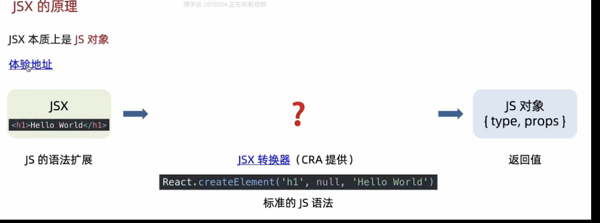
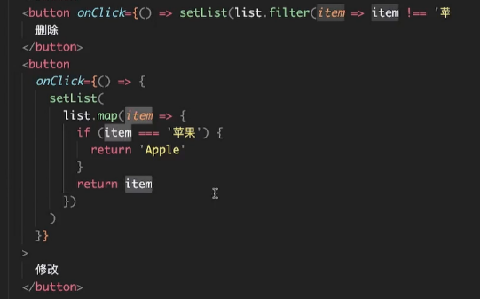
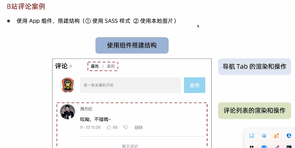

### JSX 中{}的应用：

### React 事件绑定：

- 
- 
  示例：
  

##### 阻止默认链接跳转行为：

## React 组件:

##### 注意:

##### 导入根组件：

##### 导入其他组件：

在 React 中，所有其他的组件都应该渲染在根组件 App.js 中.
放置组件的特殊情况：

### 组件状态：

示例：

##### 组件状态的规则：

##### 删除和修改数组：

##### 注意：

对象不能直接渲染，可以这样渲染：

### B 站评论案例：

#### 1.

###### 注意：

#### 2.

