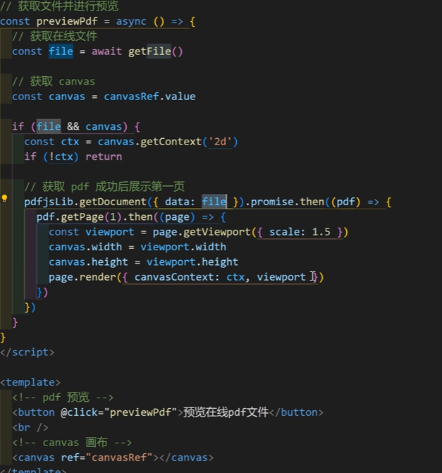

黑马哔哩哔哩上的：

从第六天起就是极客园项目。

---

区别就是:

- 管理频道案例（哔哩哔哩上是优化 B 站评论案例）
- 目前在 B 站上没找到前端就业加强课的完整版。
  就业加强课：
  

### 1.


### 2.


### 3.


### 4.


##### 面试必刷：

https://lamphc.github.io/fe-up/#/JavaScript/BOM

##### 前端就业加强课部分内容：


---

## 前端解决方案：

### 5.域名解析及项目部署的关联:

腾讯云买一个域名：


##### chatGpt 部署：

从别人的仓库里导过来的分叉：“下一个项目”，
进行 vercel 部署，用 OpenAi 的密钥（所以这个是只能用 openai 吗？），部署后，点进 domains：写入买来的域名；然后再返回到腾讯云我的解析中填写相应的数据。

### 6.请求中断：

前端：
后端重新写进一个文件夹中：


#### 请求中断具体实现（AbortController）：


##### 下载进度条：

注：这的叹号是非空断言。


### 7. 请求重试：


=>pnpm start
后端：

前端：


#### 超过时间就会请求取消（axios.creat()）：


#### 底层逻辑一部分：


#### 备注：（添加响应拦截器）在实际开发中用插件（请求重试）：

##### 用该库替换掉冗余代码：


##### 优化版：


##### 进阶优化版：

###### 1.


###### 2.


##### 总结：


#### npm 调研：


### 8.服务器发送事件（SSE）：

#### ChatGpt 打字效果-EventSource（建立 SSE 连接）：

##### 后端：


##### 前端：

###### 打开连接：


###### 关闭连接：

#### 总结：SSE 适用于简单前端场景，只有 Get 方法，写在路径参数中；更复杂的场景要结合 fetch：

在实际项目中，两者甚至可以配合使用：
比如，前端先用 fetch 向后端发起一个 POST 请求（提交用户的订阅信息，比如 “订阅股票 A 的行情”），后端处理后，前端再用 SSE 发起一个 GET 连接，后端通过这个 SSE 连接，持续向客户端推送股票 A 的实时行情。这里 fetch 负责 “主动提交订阅需求”，SSE 负责 “被动接收实时数据”，两者各司其职。

##### fetch:

###### 在 fetch 中，后端返回的数据是数据流：


###### 通过 fetch 建立和关闭连接：

> 注：用到 AbortController 中断连接。


###### 打开连接：


###### 改后端：


###### 渲染：


###### 总结：


> 注：axios 自动识别类型，fetch 需要手动添加请求头的数据类型。

### 9.虚拟列表 渲染大量数据：

#### 底层逻辑实现：


切片渲染：


#### VueUse 实现:

```js
<script setup lang="ts">
import { useVirtualList } from '@vueuse/core'
import axios from 'axios'
import { onMounted, ref } from 'vue'

type Item = {
  id: number
  name: string
}

// 所有的数据，比如这个数组存放了十万条数据
const allListData = ref<Item[]>([])

// 获取十万条数据
const getData = async () => {
  const res = await axios.get('http://localhost:3000/large-data')
  allListData.value = res.data.data
}

// 初始化加载
onMounted(() => {
  getData()
})

// 每一项的高度，比如 40 像素
const itemHeight = ref(40)

// vueuse方案：https://vueuse.org/core/useVirtualList/
const { list, containerProps, wrapperProps } = useVirtualList(allListData, {
  itemHeight: itemHeight.value,
})
</script>

<template>
  <h2>虚拟列表-VueUse实现</h2>
  <div v-bind="containerProps" class="viewport">
    <div v-bind="wrapperProps" class="list">
      <div v-for="item in list" :key="item.data.id" class="item">
        {{ item.data.name }}
      </div>
    </div>
  </div>
</template>

<style scoped lang="scss">
// 虚拟列表容器盒子
.viewport {
  box-sizing: border-box;
  width: 240px;
  height: 400px;
  border: solid 1px #000000;
  // 开启滚动条
  overflow-y: auto;
  // 开启相对定位
  position: relative;
  .list {
    width: 100%;
    height: auto;
    // 搭配使用绝对定位
    position: absolute;
    top: 0;
    left: 0;
    .item {
      box-sizing: border-box;
      width: 100%;
      height: 40px;
      display: flex;
      justify-content: center;
      align-items: center;
      // 隔行变色
      &:nth-child(even) {
        background: #c7edcc;
      }
      &:nth-child(odd) {
        background: pink;
      }
    }
  }
}
</style>
```

#### vue-virtual-scroller 实现:


注：`item-class="item"`是为了给后面自动生成的 div 盒子添加 item 类。


###### type 问题：在 github 对应的文档里面找 Issues 中的 closed 中进行查找。


加入 ts 文件后就不会警告或者是报错：


###### 能扫描到 ts 文件内容的原因是：

在 tsconfig.app.json 文件中包含了 src 目录，所以在 src 下的 ts 文件可以被扫描出来。

模块在全局是唯一的，所以不用在模块开始写上 export：


---

### Office 文件预览：

#### 微软 Office Web Viewer:

Office Web Viewer 的服务链接为：

```js
https://view.officeapps.live.com/op/view.aspx?src=[文件链接]
```

注：其中 [文件链接] 是需要预览文件的在线地址，按需替换成自己的文件链接即可。


注：出于通用性考虑，通过 `encodeURIComponent()`对特殊字符进行编码。
注：

```js
   <!-- 通过 iframe 嵌入 -->
    <iframe class="previewOffice" :src="officeUrl"></iframe>
```

补充：


###### 注意：

- 文件会传输到微软的服务器上，因此可能会涉及到文件隐私。
- 不支持 pdf 预览。
  浏览器一般可以直接预览 pdf 文件，所以微软 Office Web Viewer 不支持 pdf 预览：
  

#### pdf 预览(笔记中有 docx,xlsx 文件预览的方式)：



axios 默认的数据是 json 格式，在预览 Pdf 文件时要更改数据格式为`arraybuffer`:


#### vue-office:

简易版：

进阶版：


