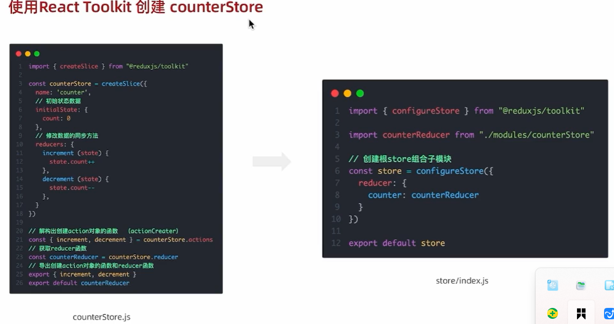
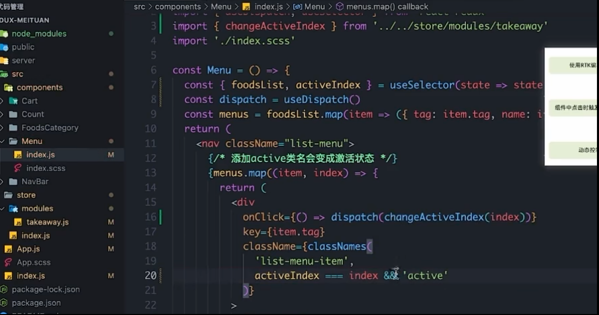

### JSX 中{}的应用：


### React 事件绑定：

- 
- 
  示例：
  

##### 阻止默认链接跳转行为：

## React 组件:


##### 注意:


##### 导入根组件：


##### 导入其他组件：


在 React 中，所有其他的组件都应该渲染在根组件 App.js 中.
放置组件的特殊情况：

### 组件状态：


示例：


##### 组件状态的规则：


##### 删除和修改数组：


##### 注意：

对象不能直接渲染，可以这样渲染：

### B 站评论案例：

#### 1.


###### 注意：


#### 2.


---


### 导航 Tab 切换：

#### orderBy:


#### 总结:


---

### classnames:


#### 1. &&:


#### 2.对象语法：


### 使用状态操作表单元素的值：


---

- value 和 onChange 需要同时出现，否则就会报错
- ref.current 代表的就是这个 dom 元素
- 对 dom 操作，用到 ref
- “数据要更改，就得有状态”

---

### useRef 与 Dom 操作:


### 发表评论：


#### 1.给评论框绑定状态，获取内容，用受控组件：


#### 2.发布评论：

##### 2.1 有内容，发布评论，同时排序：


###### 实现：


##### 2.2 对 dom 元素进行操作（无内容，获得焦点，提升体验）：


#### 总结：


---

### props:


---

#### 待办任务清单：


#### 父->子：


#### 子->父:


> 谁提供谁负责
> 子到父的通讯：父亲提供函数，传递给子，子拿到函数，回传参数，实现子到父的通讯。

---

#### 非父子之间通讯：

##### 兄弟组件通讯：


###### 1.2：


###### 3：


##### 总结：


#### 非父子组件通讯--后代关系(Context 上下文)：


##### 父组件初始：


##### 2.规定范围，提供共享数据：


##### 3.范围内的组件，获取共享数据：


##### 4.重置主题函数：


### useEffect 的使用：


#### 两种方式：


##### 方式一：以【生命周期钩子函数】为主：


##### 方式二：以功能为主：


##### 补充：


#### 总结：


#### useEffect 的扩展总结：


---

##### useEffect 清楚副作用补充（卸载时）：


在上面这种情况下，点击卸载组件时子组件中的副作用中的定时器不会关闭，要想清除这个副作用，就得卸载：


#### useEffect 的应用--发送请求：

##### 待办任务清单二：


###### 注意：


---

### 自定义 hook 使用：


### React Hooks 总结：


### 知乎-管理频道案例：


#### 1.展示或隐藏频道弹窗：


##### 打开弹窗：


##### 关闭弹窗：


#### 2.渲染频道数据：


##### 1.获取频道数据并渲染：


##### 总结：


#### 3.切换编辑或完成状态：


##### 1.处理可编辑频道：


##### 2.处理不可编辑频道：


##### 3.更新频道选中状态的函数：


###### 1.我的版块更新：


###### 2.更多板块更新：


> 优化版：
> 


## Redux:

Redux 是一个独立的状态管理库，并非 React 内置，它的设计思想基于：

- 单一状态树（Single Source of Truth）
- 状态只读（Immutable）
- 通过纯函数（reducer）修改状态
  

### Redux 与 React 的链接：


#### 配置目录：


#### 整体路径：


#### 创建 store(使用 createSlice):



##### 示例：


注：
这两个小函数是用来生成 action 对象的。

#### React 组件中使用 store 中的数据（useSelector）：


##### 示例 App.js:


#### React 组件中修改 store 中的数据(useDispatch)：


##### App.js 示例：


#### 总结：


#### 提交 action 传参实现需求（payload 属性）：


---

#### 异步状态操作：


注：异步生成的是 action 函数。

### Redux 与 React 的链接总结版：

在 Redux 中，`Provider` 是 `react-redux` 库提供的核心组件，它的主要作用是将 Redux 的 `store` 传递给应用中所有需要访问状态的组件，无需通过 props 层层传递。这是 Redux 与 React 应用连接的关键环节。

### 基本用法步骤：

1. **安装依赖**  
   首先确保已安装 `react-redux`（需配合 Redux 核心库使用）：

   ```bash
   npm install redux react-redux
   # 或使用 yarn
   yarn add redux react-redux
   ```

2. **创建 Redux Store**  
   先定义 reducer 并创建 store（这是 Redux 的基础准备工作）：

   ```javascript
   // store.js
   import { createStore } from "redux";

   // 定义初始状态和 reducer
   const initialState = { count: 0 };
   function counterReducer(state = initialState, action) {
     switch (action.type) {
       case "INCREMENT":
         return { ...state, count: state.count + 1 };
       default:
         return state;
     }
   }

   // 创建 store
   const store = createStore(counterReducer);
   export default store;
   ```

3. **使用 Provider 包裹应用**  
   在应用的根组件（通常是 `App` 组件）外层用 `Provider` 包裹，并传入 `store`：

   ```jsx
   // index.js
   import React from "react";
   import ReactDOM from "react-dom";
   import { Provider } from "react-redux"; // 导入 Provider
   import store from "./store"; // 导入创建好的 store
   import App from "./App";

   // 用 Provider 包裹根组件，并传入 store
   ReactDOM.render(
     <Provider store={store}>
       <App />
     </Provider>,
     document.getElementById("root")
   );
   ```

4. **子组件中访问 store**  
   被 `Provider` 包裹的所有子组件，都可以通过 `react-redux` 提供的 `useSelector` 和 `useDispatch` 钩子访问 store 中的状态或触发状态更新：

   ```jsx
   // Counter.js
   import { useSelector, useDispatch } from "react-redux";

   function Counter() {
     // 获取 store 中的状态
     const count = useSelector((state) => state.count);
     // 获取 dispatch 方法
     const dispatch = useDispatch();

     return (
       <div>
         <p>计数：{count}</p>
         <button onClick={() => dispatch({ type: "INCREMENT" })}>增加</button>
       </div>
     );
   }
   ```

### Provider 的核心作用：

- **传递 store 上下文**：`Provider` 内部利用 React 的 Context API 创建了一个全局上下文，将 `store` 放入其中，使得所有子组件都能访问到 `store`。
- **简化状态访问**：避免了手动将 `store` 通过 props 逐层传递给子组件的繁琐操作。
- **支持响应式更新**：当 `store` 中的状态发生变化时，使用 `useSelector` 订阅状态的组件会自动重新渲染。

### 注意事项：

- **一个应用通常只需要一个 Provider**：将其放在应用的最顶层（如 `index.js` 中），确保所有组件都能访问到 `store`。
- **必须传入 store 属性**：`Provider` 组件必须接收 `store` 作为 props，否则会报错。
- **与 Context API 的关系**：`Provider` 本质上是对 React Context 的封装，但其设计目的是专门为 Redux 的 `store` 提供全局访问能力。

通过 `Provider`，Redux 实现了与 React 应用的无缝集成，让状态管理变得更加简洁高效。

---

action 和 reducer 的关系?

#### 异步状态操作请求：


---


点击分类激活交互效果实现：



商品列表切换显示:


购物车：
action.payload 代表当前拿到的对象？


---


控制购物车显示和隐藏：


遮罩层改为：

```js
visible && "visible";
```


