黑马哔哩哔哩上的：

从第六天起就是极客园项目。

---

区别就是:

- 管理频道案例（哔哩哔哩上是优化 B 站评论案例）
- 目前在 B 站上没找到前端就业加强课的完整版。
  就业加强课：
  

### 1.

### 2.

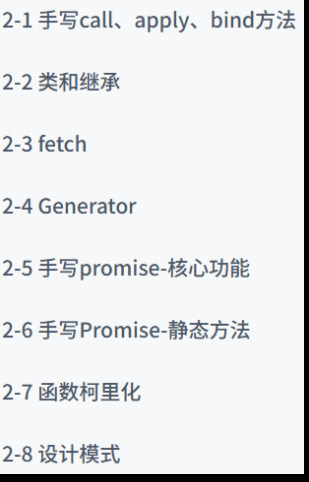

### 3.

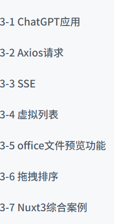

### 4.

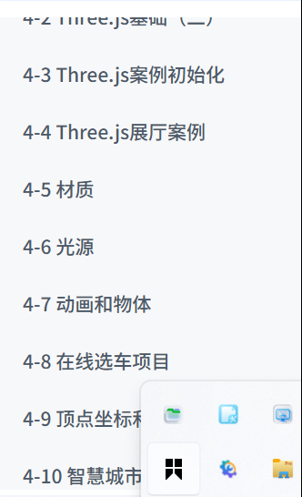

##### 面试必刷：

https://lamphc.github.io/fe-up/#/JavaScript/BOM

##### 前端就业加强课部分内容：

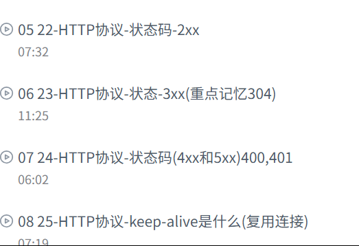
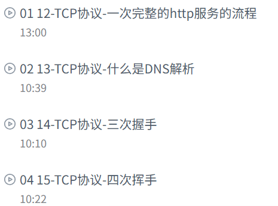

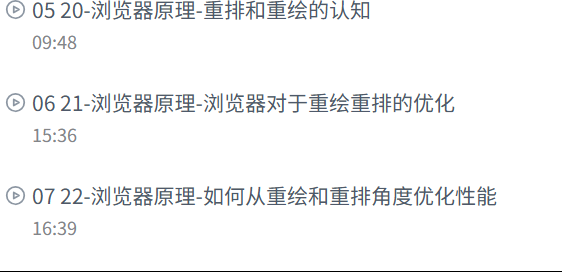
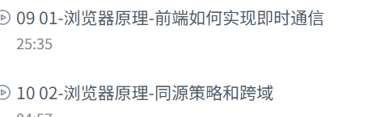
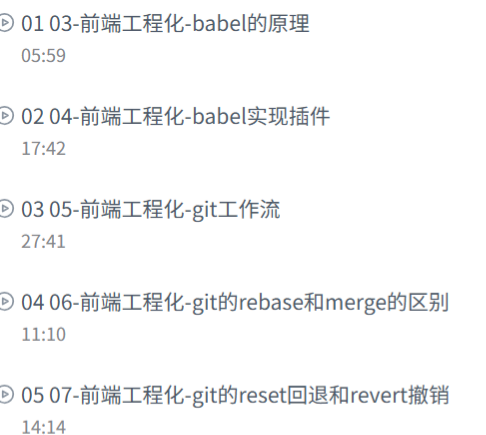
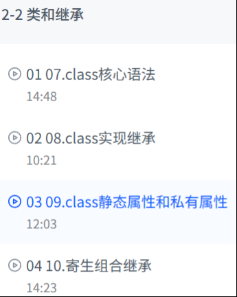
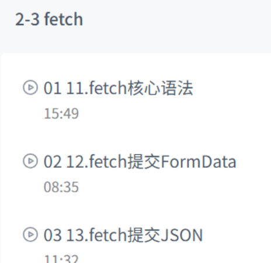
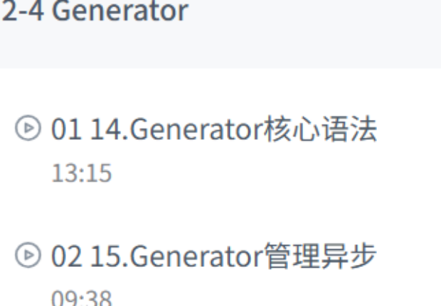
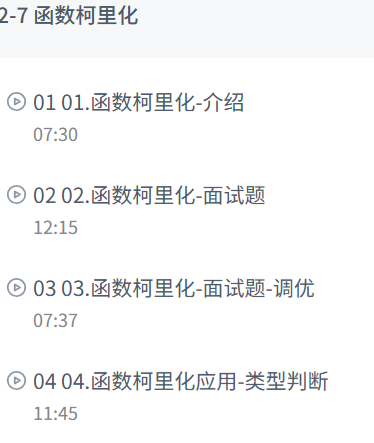
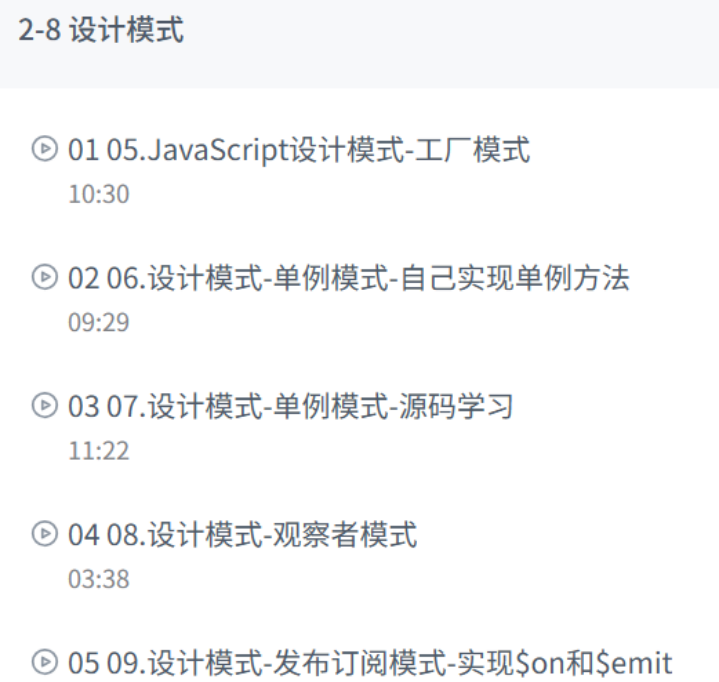

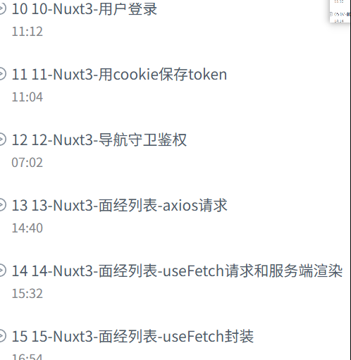

---

### 5.域名解析及项目部署的关联:

腾讯云买一个域名：
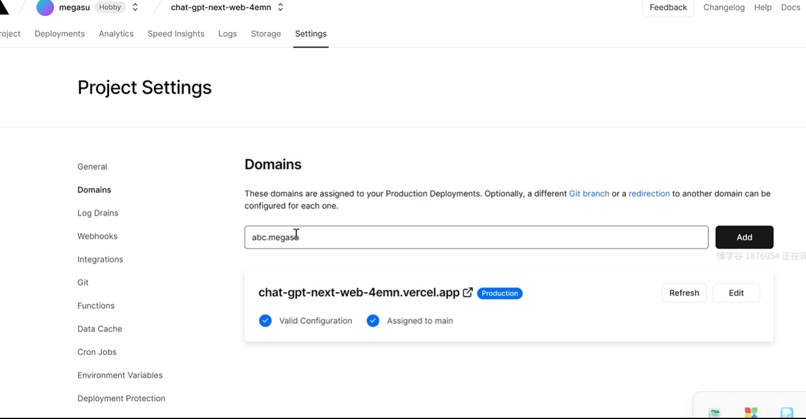
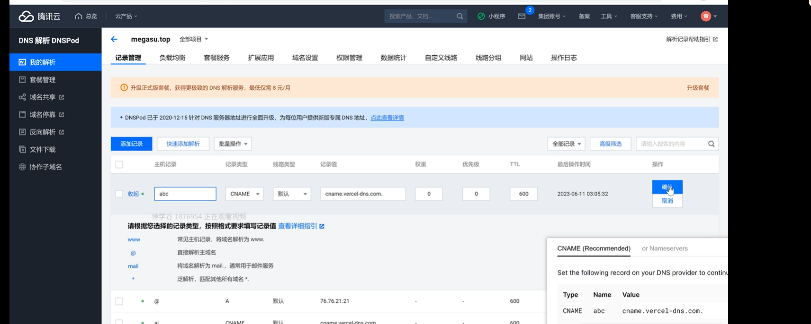

##### chatGpt 部署：

从别人的仓库里导过来的分叉：“下一个项目”，
进行 vercel 部署，用 OpenAi 的密钥（所以这个是只能用 openai 吗？），部署后，点进 domains：写入买来的域名；然后再返回到腾讯云我的解析中填写相应的数据。

### 6.请求中断：

前端：
后端重新写进一个文件夹中：
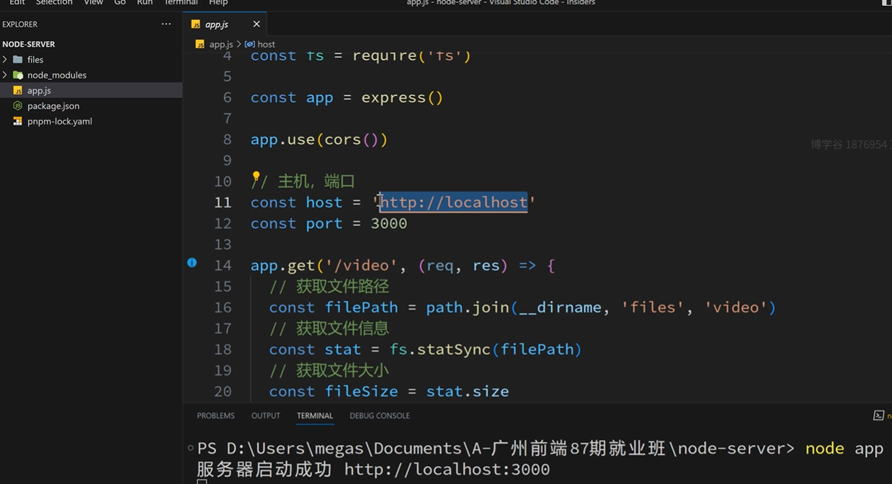

#### 请求中断具体实现（AbortController）：

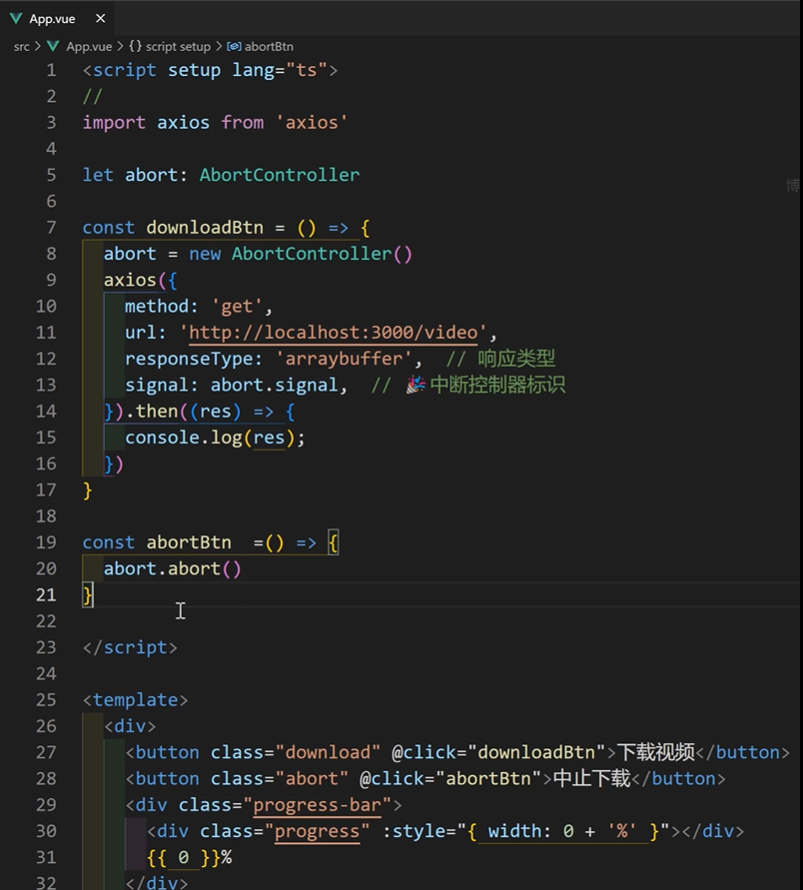

##### 下载进度条：

注：这的叹号是非空断言。
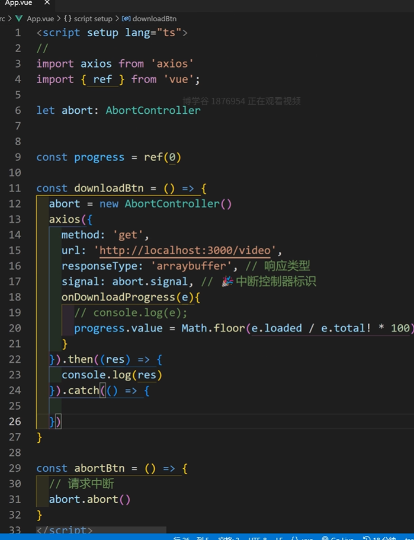

### 7. 请求重试：

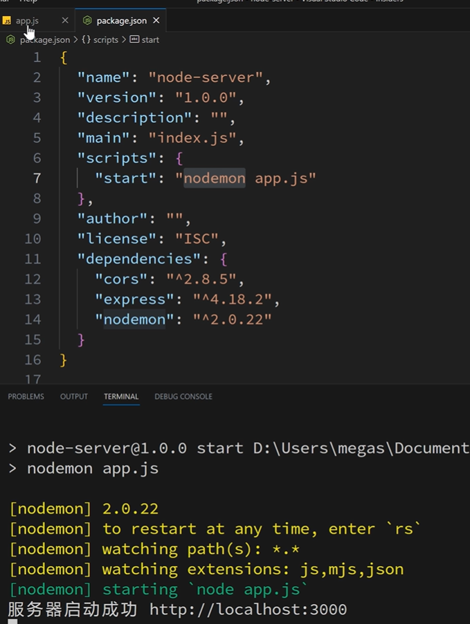
=>pnpm start
后端：

前端：
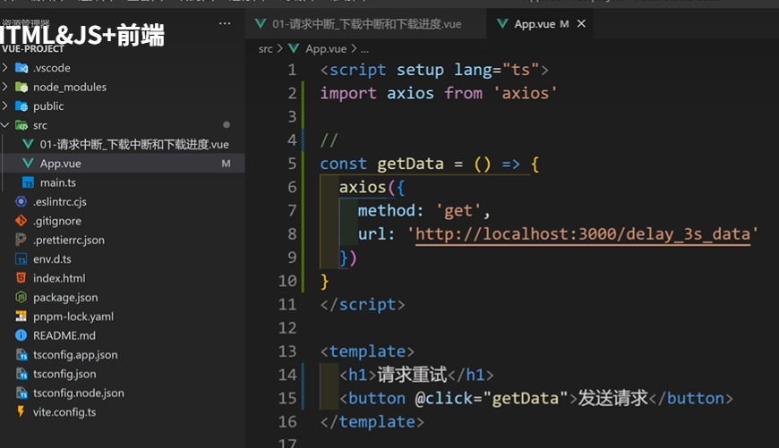

#### 超过时间就会请求取消（axios.creat()）：

#### 底层逻辑一部分：

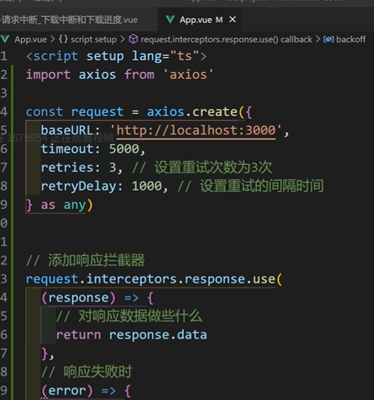

#### 备注：（添加响应拦截器）在实际开发中用插件（请求重试）：

##### 用该库替换掉冗余代码：

##### 优化版：

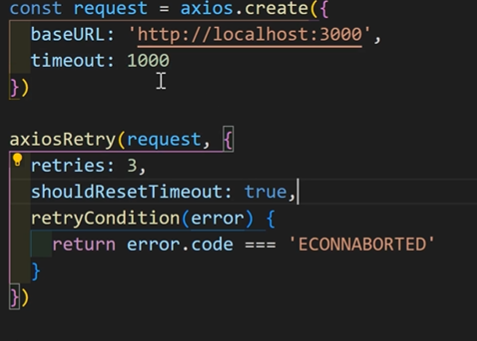

##### 进阶优化版：

###### 1.

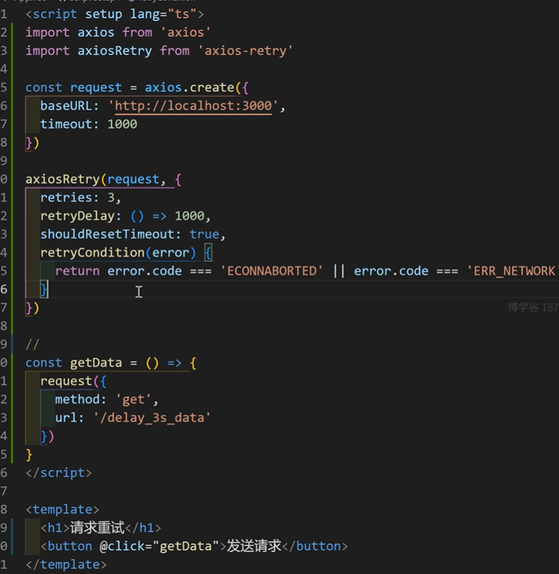

###### 2.

##### 总结：

#### npm 调研：

