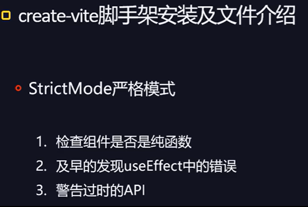
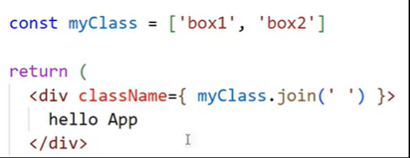
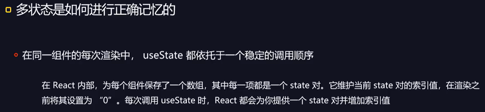
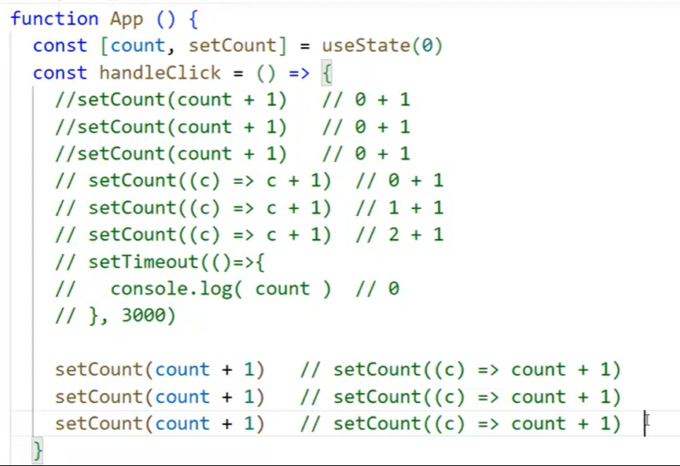

集成？node.js，提供其中多个模块。


---





---

在 js 及 jsx 环境下不能直接用含有-的属性：
例如（错误示例）：

想用 css 中带有-的属性，可以：

想要实现直接用驼峰命名法的样式属性：

需要配置：

sass 预处理器需要自己配置，已落后。

---





---


---

## 组件是一个纯函数：


严格模式：

调用两次，就是为了让开发者意识到使用方式存在问题（非纯函数会检测出问题（返回的结果不一样），纯函数则不会）。

## 状态：


错误实现：


###### 这段代码不能更新视图的原因是：

- React 更新视图的工作机制是：依赖“状态变化”触发重新渲染：
  React 组件的 UI 展示是基于组件函数的执行结果的。在没有状态的情况下，UI 始终展示第一次执行时的结果。
  在这里 count 值会变，但是只是普通 JS 变量的修改，React 并“不知道”这个变量变了（重点：React 的 UI 渲染只依赖组件函数执行时的变量值）。
  因为 React 只在两种情况下会重新执行组件函数：
  - 组件的状态（State） 发生变化（通过 useState 的更新函数触发）。
  - 组件的父组件传递的 props 发生变化。
    > 总结：
    > 内存中的变量变了，但 React 没有重新渲染 UI 去读取这个值。

状态是如何改变试图的：

普通函数举例：

状态是如何改变视图的：
初次渲染：

初次渲染是画蓝色的部分，第二步骤是渲染 APP 组件。

多状态是如何进行正确记忆的：

多状态按照编写的顺序进行记忆：

这里有关于要在顶部定义状态，不能在 If 等逻辑语句里面定义状态。

### 快照：


点击函数里面的 count 是按照作用域中初始的值来渲染。

即使两秒之后渲染函数，依旧找的是初始作用于下的值。

这里的`setCount(c=>c+1)`实际上变化的是形参`c`，不受作用于限制，所以`c`会每一次都发生改变；
而`setCount(count+1)`中的`count`是实参,受作用于限制，每次调用这个状态改变函数时，都会找当前作用域下的初始的值，只有当该点击函数彻底走完，转回去改变状态重新渲染时才会更改函数作用域内的`count`值。

同上面，`count`不变。

同上面，`count`不变，`c`变。
当修改状态的值没有发生改变时，函数组件并不会重新渲染：


### 常见数组和对象的状态改变解决方案：


上述第一种错误情况相当于状态的值没有改变，所以不会重新渲染。

#### 展开语法示例：


#### 深拷贝方案：cloneDeep():


克隆时会整体克隆，在某些情况下会浪费空间。

#### 改良方案：Immer:

```js
import { useImmer } from "use-immer";

function App() {
  const [list, setList] = useImmer([
    { id: 1, text: "aaa" },
    { id: 2, text: "bbb" },
    { id: 3, text: "ccc" },
  ]);

  const handleUpdate = () => {
    setList((draft) => {
      // 1. 直接修改数组中的对象
      const target = draft.find((item) => item.id === 2);
      if (target) target.text = "new bbb";

      // 2. 直接向数组新增元素
      draft.push({ id: 4, text: "ddd" });
    });
  };

  return (
    <div>
      <button onClick={handleUpdate}>更新列表</button>
      <ul>
        {list.map((item) => (
          <li key={item.id}>{item.text}</li>
        ))}
      </ul>
    </div>
  );
}
```

可以直接更改需要改动的值，高阶版状态，适用于复杂类型状态改动？
useImmer 特别适合复杂类型（对象、数组，尤其是嵌套结构）的状态管理，它通过 “允许直接修改草稿” 的方式，既保持了 React 所需的 “不可变性”，又大幅简化了代码，提升开发效率。

###### Immer 的核心原理是 “代理 + 草稿（draft）”：

- 当调用 setList(draft => { ... }) 时，Immer 会创建当前状态的 “代理草稿（draft）”。
- 可以像修改普通变量一样直接修改 draft（比如 draft.push(...)、draft[0].text = 'xxx'）。
- Immer 会自动追踪 draft 的修改，最终生成一个全新的、不可变的状态副本，并触发 React 重新渲染。

### 惰性初始化状态：


上述这种情况下会出现每次更改状态时都会重新调用 computed()函数：

- useState 的特性是：仅在组件首次渲染时使用参数作为初始值，后续渲染会忽略参数，直接返回当前状态。但这并不影响 “参数本身被执行”——computed(0) 依然会在每次渲染时运行，只是其结果不会被 useState 采用。
- 为什么会这样？
  useState 的参数（这里是 computed(0)）是一个 “初始化函数 / 值”，但它的执行时机是每次组件渲染时，而不是仅在初始化时。框架会在内部判断：“如果是首次渲染，就用这个参数作为初始值；如果是重新渲染，就忽略这个参数”。

如果希望 computed 只在初始化时执行一次（避免每次渲染都调用），可以将其放在 useState 的 “函数式初始化” 中。React 会确保函数式初始化的参数仅在首次渲染时执行一次：

#### 使用惰性初始化状态--使用箭头函数：


### 状态提升解决共享：


普通情况下，同一个组件的复用，互不干扰。这点等同于函数作用域问题，多次调用同一个函数，相当于开辟了多个空间，互不干扰。
结果如下：


#### 状态提升--共享：


重点：上述图解详细见于父子组件通信。

即将状态放在父组件中，父组件往子组件传递。

### 状态的重置处理：


- 当组件被销毁时，所对应的状态会被重置：
  
- 当组件的位置没有发生改变时，状态不会被重置：
  

- 不销毁的情况下重置状态：
  
  - 不同的结构体：
    
  - 给组件添加 Key 属性：
    
